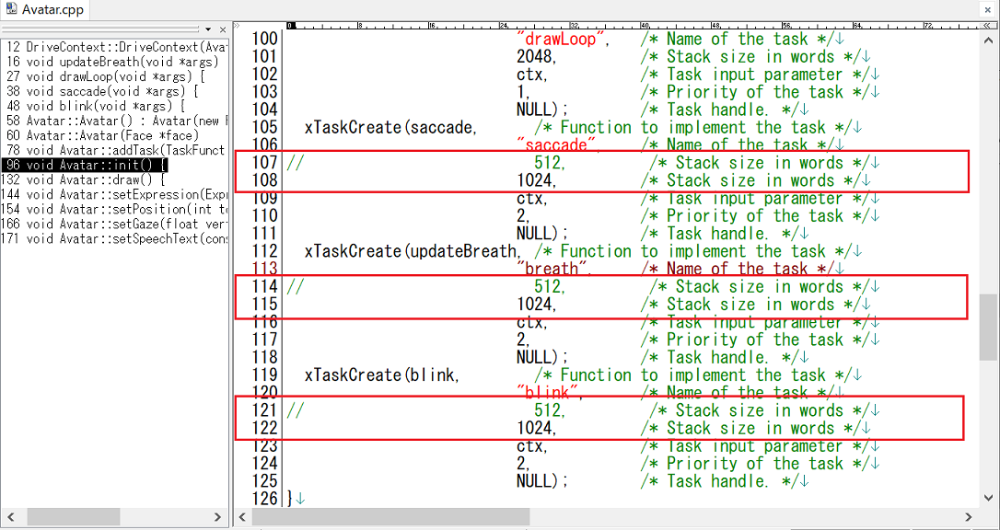

# M5Core2_Avatar_VoiceText_TTS
M5Stack Core2で、M5Stack-AvatarとHOYA社が提供する[VoiceText Web APIサービス](https://cloud.voicetext.jp/webapi "Title")を使った音声合成(TTS)を動かすテストプログラムです。

M5Core2_VoiceText_TTSは、kghrlaboさんのesp32_text_to_speechを参考にさせていただきました。 
オリジナルはこちら。 
esp32_text_to_speech <https://github.com/kghrlabo/esp32_text_to_speech> 

---

### 必要な物 ###
* [M5Stack Core2](http://www.m5stack.com/ "Title") (M5Stack Core2、M5Stack Core2 for AWSで動作確認をしました。) 
* Arduino IDE (1.8.15で動作確認をしました。) 
* [M5Stack-Avatar](https://github.com/meganetaaan/m5stack-avatar/ "Title")ライブラリ 
* [ESP8266Audio](https://github.com/earlephilhower/ESP8266Audio/ "Title")ライブラリ  

### M5Stack-Avatarライブラリの変更 ###
* "Avatar.cpp"の下図赤枠部分を変更します。
  

### WiFiの設定 ###
* M5Core2_VoiceText_TTS.inoの8行目付近、SSIDとPASSWORDを設定してください。

### VoiceText Wev API api キーの設定 ###
* AudioFileSourceVoiceTextStream.cppの30行目付近、YOUR_TSS_API_KEYを設定してください。 

APIキーは。[ここ](https://cloud.voicetext.jp/webapi/ "Title")の「無料利用登録」から申請すれば、メールで送られて来ます。 

### 使い方 ###
* M5Stack Core2のボタンA,B,Cを押すと、それぞれ異なった声でしゃべります。　 

  

